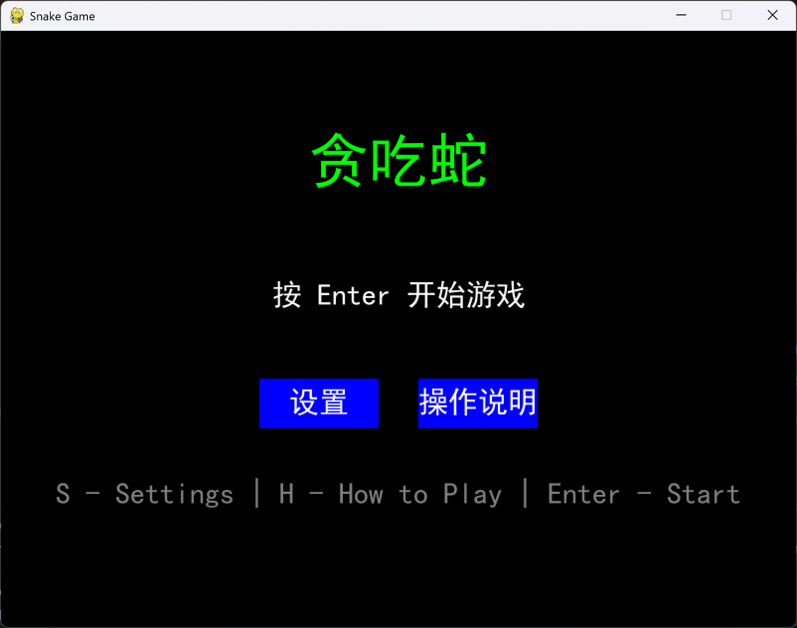
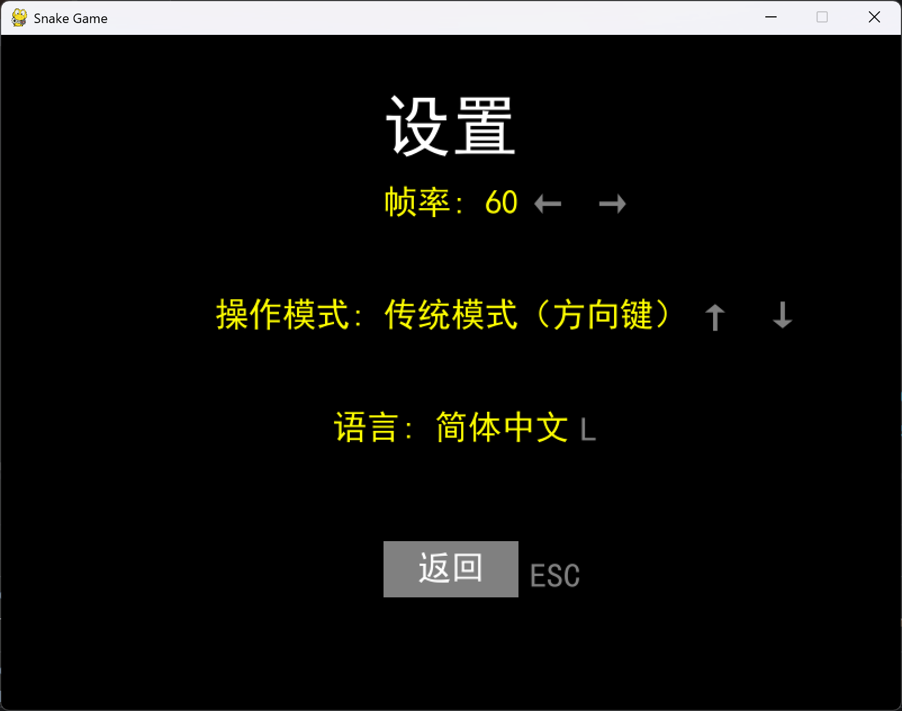
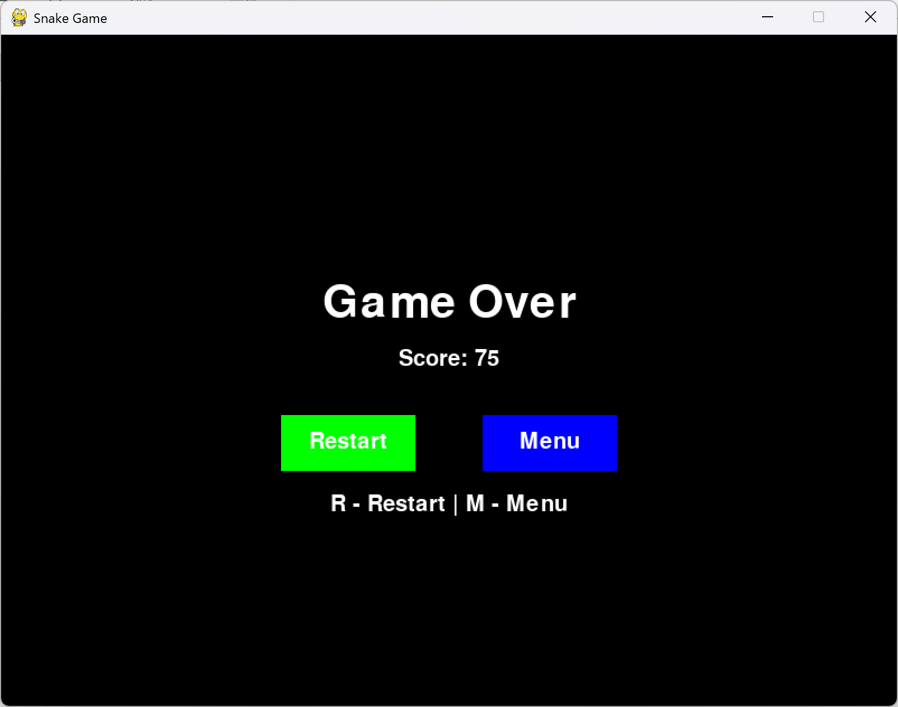

# Snake(贪吃蛇)

一个基于 Pygame 构建的经典贪吃蛇游戏

## 项目结构

```
pygame-snake-game/
├── snake.py          # 游戏主程序
├── requirements.txt  # Python 依赖库
├── Pictures/         
├── LICENSE
└── README.md
```

> `requirements.txt`中使用了清华源。

## 功能特性

- 经典贪吃蛇玩法：吃食物得分，撞墙或撞到自己则游戏结束
- 两种操作模式：传统模式（方向键）/ 左右转向模式
- 可调帧率：10 / 30 / 60 FPS
- 中英文双语界面（需系统中文字体支持）
- 主菜单、设置界面、操作说明、游戏结束界面

## 环境要求

- Python 3（建议 3.14）
- 标准库：`random`、`sys`
- 第三方库：`pygame-ce`（见 `requirements.txt`）

## 运行方式

### GNU/Linux

在终端中依次执行：

```sh
git clone https://github.com/isere1n/pygame-snake-game.git
cd pygame-snake-game
python3 -m venv .venv
source .venv/bin/activate
pip install -r requirements.txt
python3 snake.py
```

> 提示：如需中文界面，请确保系统安装了中文字体（如 Noto Sans CJK SC），否则界面将回退为英文。

### macOS

建议使用源码运行，命令与 GNU/Linux 相同。

仓库也提供了预编译的 `snake.dmg`。

### Windows

可直接使用预编译二进制文件游玩，无需安装 Python。

如需从源码运行，确保环境中已安装 Python 3，然后在终端中执行：

```bat
git clone https://github.com/isere1n/pygame-snake-game.git
cd pygame-snake-game
python -m venv .venv
.venv\Scripts\activate
pip install -r requirements.txt
py snake.py
```

## 操作说明

- 主菜单：`Enter` 开始游戏，`S` 设置，`H` 操作说明（也可点击按钮）
- 传统模式：`↑ ↓ ← →` 控制移动，不能直接反向
- 左右转向模式：`←` 逆时针转向，`→` 顺时针转向
- 游戏结束：`R` 重新开始，`M` 返回主菜单
- 设置界面：`← →` 调帧率，`↑ ↓` 切换操作模式，`L` 切换语言，`ESC` 返回

## 游戏截图







## 许可证

本项目使用[AGPL v3协议](./LICENSE)开源。
